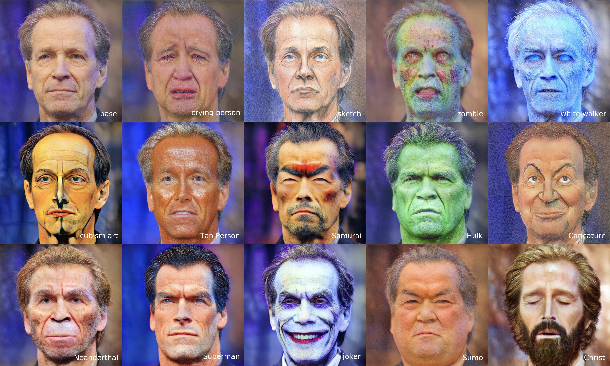

# Domain Expansion of Image Generators <br><sub>Official Implementation</sub>
This repo contains training and synthesis code for domain-expanded models as well as pre-trained weights.

### [Paper](https://arxiv.org/abs/2301.05225) | [Project Page](https://yotamnitzan.github.io/domain-expansion/) | [Demo](https://huggingface.co/spaces/YotamNitzan/domain-expansion)




> [**Domain Expansion of Image Generators**](https://yotamnitzan.github.io/domain-expansion/)<br>
> [Yotam Nitzan](https://yotamnitzan.github.io/), [Michaël Gharbi](http://mgharbi.com/),
> [Richard Zhang](https://richzhang.github.io/), [Taesung Park](https://taesung.me),
> [Jun-Yan Zhu](https://www.cs.cmu.edu/~junyanz/), [Daniel Cohen-Or](https://danielcohenor.com/),
> [Eli Shechtman](https://research.adobe.com/person/eli-shechtman/) <br>
> <br>Tel-Aviv University, Adobe Research, CMU<br>

Abstract: Can one inject new concepts into an already trained generative model, while respecting its existing structure and
knowledge? We propose a new task - domain expansion - to address this. Given a pretrained generator and novel (but
related) domains, we expand the generator to jointly model all domains, old and new, harmoniously. First, we note the
generator contains a meaningful, pretrained latent space. Is it possible to minimally perturb this hard-earned
representation, while maximally representing the new domains? Interestingly, we find that the latent space offers
unused, dormant directions, which do not affect the output. This provides an opportunity: By repurposing these
directions, we can represent new domains without perturbing the original representation. In fact, we find that
pretrained generators have the capacity to add several - even hundreds - of new domains! Using our expansion method, one
expanded model can supersede numerous domain-specific models, without expanding the model size. Additionally, a single
expanded generator natively supports smooth transitions between domains, as well as composition of domains.

## Setup

Code was tested with Python 3.8.13, Pytorch 1.7.1 and CUDA 11.3 on Ubuntu 20.04. 

This repository is built on top of [stylegan2-ada-pytorch](https://github.com/NVlabs/stylegan2-ada-pytorch). You can follow their setup instructions and install our additional dependencies with:

```
pip install git+https://github.com/openai/CLIP.git
pip install wandb lpips
```

Altenatively, we provide an [`environment.yml`](environment.yml) file that can be used to create a Conda environment from scratch.

```
conda env create -f environment.yml
```


## Inference

You can generate aligned images - i.e., the same latent code projected to various subspaces - using [generate_aligned.py](generate_aligned.py).
<br>
MyStyle operates slightly different since the effect of training is local,
and hence a latent is often meaningless in different subspaces.
To generate with MyStyle-repurposed subspace, you can use [generate_mystyle.py](generate_mystyle.py).

For convenience, we provide a couple of pretrained NADA-expanded models:

Parent Model    | Number of new domains | Model
|---------------|-----------------------|------------------|
[StyleGAN2 FFHQ](https://nvlabs-fi-cdn.nvidia.com/stylegan2-ada-pytorch/pretrained/ffhq.pkl)  | 100 | [Model](https://drive.google.com/file/d/1PJdY4aGHHqoyMN-J8B2l2oi3wjzIUA_r/view?usp=share_link) |
[StyleGAN2-ADA AFHQ Dog](https://nvlabs-fi-cdn.nvidia.com/stylegan2-ada-pytorch/pretrained/afhqdog.pkl)  | 50 | [Model](https://drive.google.com/file/d/1fmSv5D5jfrVXTYFpwzUoNOed8aQT68jv/view?usp=share_link)              |

## Training

Training interface is similar to that in [stylegan2-ada-pytorch](https://github.com/NVlabs/stylegan2-ada-pytorch), with a few additional arguments. A training command example is given [here](scripts/train_example.sh).

Parameter `--expansion_cfg_file` points to a JSON configuration file specifying the domain expansions to perform.
Two examples, applying NADA and MyStyle, are in `config_examples` directory.

Here's NADA's example:

```
{
    "tasks": [
      {"type": "NADA", "dimension": 510, "args": {"source_text": "photo","target_text": "sketch"}},
      {"type": "NADA", "args": {"source_text": "person","target_text": "tolkein elf"}}
    ],
    "tasks_losses": {
        "NADA" : {
            "clip_models": ["ViT-B/32","ViT-B/16"],
            "clip_model_weights": [1.0, 1.0]
        }
      }
}
```

The first key, "tasks", defines the training task to perform on specific latent directions.
If the dimension number is not specified, we use the "most dormant" direction that isn't already specified. In the above example, elf would repurpose the dim 511.
Different tasks might perform the same adaptation method. We therefore specify shared arguments separately under "tasks_losses".

Since adaptation methods might require different number of steps, we recommend expanding the domain gradually.
For example, repurpose several subspaces with MyStyle first.
When results are satisfactory, repurpose more subspace with NADA.

### Support Additional Domain Adaptation Methods

To extend this repository and support additional domain adaptation tasks, you only need to define a new class inheriting from [BaseTask](training/adaptation_tasks.py). Please consider sending us a pull request if you do! 

## BibTeX

```bibtex
@article{nitzan2023domain,
  title={Domain Expansion of Image Generators},
  author={Nitzan, Yotam and Gharbi, Micha{\"e}l and Zhang, Richard and Park, Taesung and Zhu, Jun-Yan and Cohen-Or, Daniel and Shechtman, Eli},
  booktitle={Proceedings of the IEEE conference on computer vision and pattern recognition},
  year={2023}
}
```

## Acknowledgments

Our code is built on top of [stylegan2-ada-pytorch](https://github.com/NVlabs/stylegan2-ada-pytorch) and borrows
from [StyleGAN-NADA](https://github.com/rinongal/StyleGAN-nada) and [MyStyle](https://github.com/google/mystyle).

Thanks to [alvanlii](https://github.com/alvanli) for creating the HuggingFace Demo!